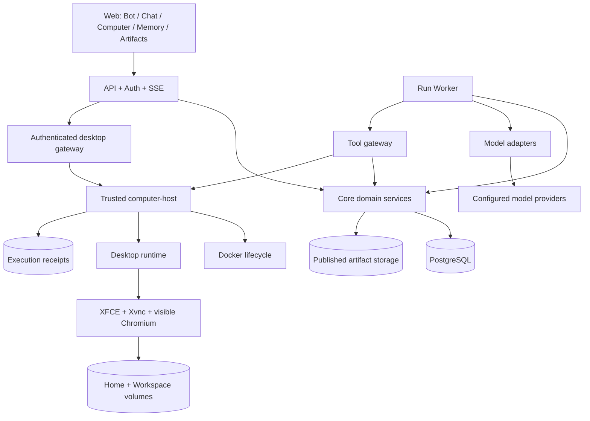
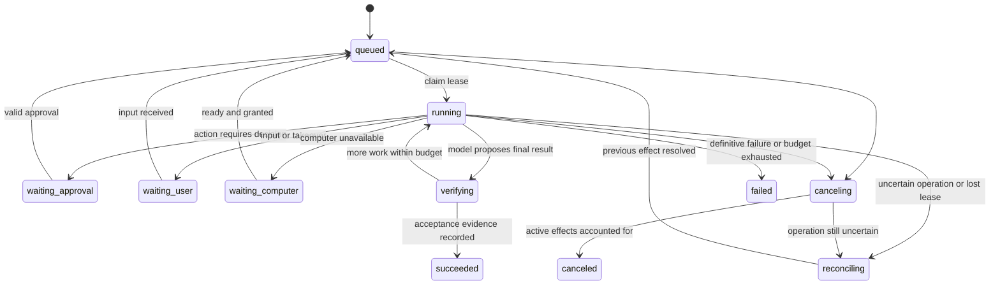

# OpenGrok Bot 架构设计

日期：2026-10-05；实施校对：2026-10-06。状态：设计基线 + 开发原型，未完成全部计划验收。

配套文档：[实施计划](PLAN.md)、[设计决策](DESIGN_DECISIONS.md)。下方领域接口和目录树表达目标契约；当前真实 API/类型以代码为准。已实现 Web、Run/工具状态机、Bot 记忆、电脑回执、同屏桌面、经审批的浏览器与桌面操作、逐命令终端停止、技能版本快照、持久例程触发，以及确认执行器空闲后的 unknown 人工结案。本机 HTTPS、systemd 用户服务和监测 timer 已运行。当前 computer-host 在本机通过只读查询 PostgreSQL 核验 Run 租约，使用固定 bearer token 与控制服务通信；短期签名授权、完整网络隔离和公网部署仍待实施。

## 1. 从用户任务定义架构

用户创建“研究助手”，指定职责和可用模型，然后发出任务：“研究这三个方案，给我一份有来源的报告。”Bot 在持久电脑中浏览网页、处理文件。用户能在电脑视图看到同一浏览器；关闭客户端不会终止服务端任务。需要登录时，用户接管电脑；完成登录并归还后 Bot 继续。成果保存在任务和电脑中，下一次对话仍可使用。

用户说“报告先给结论，再列来源”，Bot 将这条明确偏好保存到自己的记忆。之后新建对话、切换模型，仍能使用这条偏好。Bot 的名字、职责、任务状态和记忆属于应用；模型负责当前步骤的推理。

公开参考中，Grok Bot 的多个 Bot 共用用户的一台持久电脑，文件和网站登录会共享。[官方 FAQ](https://docs.x.ai/grok-bot/faq) 本项目沿用这个产品边界：一个用户一个 Computer，多 Bot 私有语义记忆，电脑文件和登录共享。技能采用用户拥有的版本化技能库，Bot 按需绑定；例程归某个 Bot。

三个调用场景先约定如下。`actor` 来自服务器认证，客户端不能自报 owner；示例只表达领域调用。

```ts
// 聊天提交与断线恢复：同一个请求重复提交返回同一个 Run。
const run = await runs.submit(actor, {
  botId, conversationId, text: "研究三个方案，生成带来源的报告",
  idempotencyKey: clientRequestId,
});
for await (const event of runs.events(actor, run.id, lastEventCursor)) {
  render(event);
}
```

```ts
// 登录接管：仅 granted 表示已获得控制；交接未完成时返回 pending。
const handoff = await computers.takeControl(actor, { computerId });
if (handoff.kind === "granted") {
  openDesktop(handoff.desktopSession);
  onUserReturnControl(() => computers.returnControl(actor, {
    computerId, controlId: handoff.controlId,
  }));
}
// 恢复时重新观察页面，旧的点击位置和审批上下文不得直接复用。
```

```ts
// 修改记忆：来源和期望版本随写入提交，服务负责归属与并发检查。
const saved = await memories.put(actor, {
  botId, memoryId, expectedRevision,
  content: "报告先给结论，再列来源", kind: "preference", sourceMessageId,
});
```

## 2. 总体结构



这是一个模块化服务配两个受信后台执行入口：API/Worker 共享核心模块，computer-host 独占 Docker 管理权限。桌面容器中运行桌面与受限执行协议，不运行产品数据库或持有模型供应商密钥。

后台任务不寄生于 HTTP 请求、WebSocket 或浏览器 tab。PostgreSQL 保存业务状态，Worker 通过租约领取任务。初版没有独立消息队列，轮询任务表即可；通知机制只能优化唤醒，不能成为唯一投递依据。

## 3. 核心对象与唯一所有权

| 对象 | 持久内容 | 唯一写入模块 | 关键约束 |
| --- | --- | --- | --- |
| User / Workspace | 用户身份、配置、电脑引用 | accounts | 服务端确定归属 |
| Bot | 名字、职责、模型配置、工具策略及版本 | bots | 配置变更产生 revision |
| Conversation / Message / RunInput | 用户消息、助手可见内容、有序补充输入 | runs | 消息、输入去重和 Run 关联同一事务 |
| Run | 输入、状态、预算、租约、配置快照 | runs | 一个 Run 一个有效 Worker epoch |
| BotExecutionSlot | 当前占用该 Bot 的 Run | runs | 跨等待和重新排队保留，终态事务释放 |
| ModelStep | 已组装输入引用、完整模型输出、供应商续接引用 | runs，经 models 转换 | 未完整接收的工具调用不可执行 |
| ToolCall / Approval | 参数、效果类型、批准摘要、执行与核对状态 | runs | 一次批准绑定一次具体调用 |
| RunEvent | 有序执行事件、状态变化与证据引用 | runs | 与状态更新同事务提交 |
| Computer / Control | 镜像、卷、健康、控制者、generation | computers | 每用户一个电脑，每电脑一个控制者 |
| Memory / Revision | Bot 事实与偏好、来源、版本、删除标记 | memories | 检索先限定用户和 Bot，写入 CAS |
| Artifact | 文件摘要、格式、大小、发布状态、Run 来源 | artifacts | 复制并校验后才可发布 |
| Skill / Version | 用户技能库及 Bot 绑定 | skills，M6 | 技能不增加权限 |
| Routine / Occurrence | 时区、计划、预算、触发记录 | routines，M6 | 同一 occurrence 只创建一个普通 Run |
| ExecutionReceipt | 电脑操作接收、进程状态、退出码、结果引用 | computer-host | 只记录物理执行，不拥有 Run 业务状态 |

当前状态行是操作依据，追加事件用于追踪和前端恢复。状态与事件原子写入；初版不做全量事件溯源重建。工具目录负责 schema、执行适配和结果核验，不能自行修改 Run 状态。desktop-runtime 同样无权把任务标为完成。

成果文件落在控制服务的 `OPENGROK_DATA_DIR/artifacts`。第 13 版迁移把旧 `artifacts.storage_path` 规范化为相对成果根目录的路径，新成果也按相对路径登记；读取时拒绝逃逸成果目录的路径。隔离库的 121 条旧记录迁移后文件与 SHA-256 均一致。本机离线备份已把 PostgreSQL、成果、桌面两卷、host journal 与单独密钥包恢复到新数据库、目录和卷；历史成果 API 下载、恢复桌面文件/网页读取及新 Run 经恢复 Host 派发均通过。异机存放、自动化生产部署和站点登录会话寿命另需验收，详见 [OPERATIONS.md](OPERATIONS.md)。

电脑文件系统与语义记忆各有用途：`/workspace` 存用户工作材料，数据库记忆存跨任务的事实与偏好。聊天历史保留原始上下文，摘要是派生内容，不能替代执行证据。

## 4. Docker + Linux 桌面

### 4.1 桌面镜像与进程

基线为自建 Ubuntu 24.04 镜像，构建时安装并锁定 XFCE、TigerVNC、websockify、Node、Python、中文字体及 Playwright 对应 Chromium。应用镜像和依赖版本在 M1 冻结；默认工具在构建期准备，任务期间只按实际需要添加用户目录依赖。

```text
computer container (fixed non-root desktop user: muse)
  init / process supervisor
    Xvnc :1                  virtual X display + VNC server
    XFCE                     desktop session
    desktop-runtime          typed tool endpoint + managed processes
      headed Chromium        DISPLAY=:1, one persistent browser context
      command process groups cwd/time/output limits per operation
    websockify               internal WebSocket-to-VNC bridge
```

TigerVNC Xvnc 同时提供虚拟 X 显示与 VNC 服务，无需另外叠加 Xvfb。noVNC 位于 Web 客户端，通过已认证入口连接内部桥接服务。Web 可在适应窗口与原尺寸裁剪视图之间切换；原尺寸时由 noVNC 拖动视口，不重新建立 WebSocket。手机人工接管模式额外提供显式回车键。[Xvnc 文档](https://tigervnc.org/doc/Xvnc.html) · [noVNC 文档](https://novnc.com/noVNC/)

desktop-runtime 使用 `launchPersistentContext(profilePath, { headless: false })` 启动并持有浏览器。DOM 工具通过它操作页面；noVNC 展示同一 DISPLAY；视觉工具截取这个显示的画面。Worker 不另外启动无头浏览器，也不持有裸 CDP 地址。浏览器连接由 runtime 内部管理，API 重启不影响它；runtime/容器重启则重开浏览器并恢复可持久的 profile 数据。[Playwright BrowserType](https://playwright.dev/docs/api/class-browsertype)

DOM 实现给每次 `browser_read` 分配短期 `observationId` 和元素 `ref`；审批从对应观察提取目标和页面 URL，实际点击/填写时 runtime 再核验同一页面及仍有效的引用。再次读取、导航或接管后旧引用不能执行。`desktop_observe` 用 `scrot` 从同一 X11 显示抓取完整 PNG，返回 `observationId`、尺寸、session、generation 与控制 epoch。视觉模型在下一步临时读取已按摘要复核的截图，数据库步骤快照只留成果元数据。`desktop_click/key/type` 逐次审批并展示截图与具体坐标或输入，审批要求最新观察、120 秒内、generation/epoch 相同，点击还须落在截图边界内；runtime 再以当前观察 ID 核验。屏幕动作、导航或人类接管后旧观察失效。当前未实现目标契约中的独立采样时间字段或任意应用的语义控件识别，模型坐标精度仍需评测。

浏览器以非 root 身份运行，`chromiumSandbox: true`。桌面 Compose 使用固定的 Playwright 1.63.0 seccomp 配置，在 Docker 默认限制之外允许创建用户命名空间；仍保留 `no-new-privileges`。隔离容器完整启动后，网页导航、页面读取和桌面截图通过，渲染进程进入嵌套用户命名空间；正式实例重建后也通过公开站点导航与回读。该配置只解决 Chromium 进程 sandbox，容器出口防火墙和任意桌面程序的网络边界仍未实现。使用自建运行镜像；Playwright 官方测试镜像只作为构建基础，当前配置不能直接当作公开部署配置。[Playwright Docker](https://playwright.dev/docs/docker)

### 4.2 持久数据与重建

| 路径 / 卷 | 内容 | 重建桌面后 |
| --- | --- | --- |
| `home_<computer_id>` -> `/home/muse` | 专用浏览器 profile、桌面配置、用户环境 | 保留 |
| `workspace_<computer_id>` -> `/workspace` | 工作文件、下载、任务目录、用户安装的依赖 | 保留 |
| `/workspace/runs/<run_id>` | 本次任务中间文件与候选产物 | 保留，可按策略清理 |
| `/tmp`、运行 socket、进程内存 | 临时数据和活跃进程 | 丢失 |
| 独立 `artifact_data` | 已发布成果的不可变副本 | 不随桌面重建变化 |
| 独立 `postgres_data` | Bot、历史、Run、记忆、审批 | 不随桌面重建变化 |
| 独立 `computer_host_data` | 命令回执及受信执行记录 | 不交给桌面用户修改 |

Docker named volume 的生命周期独立于容器；首次初始化只补缺失配置，不能覆盖已有 home。[Docker Volumes](https://docs.docker.com/engine/storage/volumes/) 在镜像层临时安装的软件不承诺重建后保留；应通过镜像版本或 `/workspace` 下可重建的环境保存。

容器重启终止进程，文件持久化不会恢复任意 Linux 进程的内存。已有 Run 从最后确定的步骤核对后继续。网页登录可能被站点撤销，浏览器 profile 保留不代表永久登录。

`opengrok-network.service` 先创建 IPv4-only 桌面网桥但不启动容器，将该网桥的转发流量限定为指定上游 DNS 的 UDP/TCP 53，其他转发拒绝；到宿主机仅开放网桥网关的 TCP 3888 与已建立连接。宿主机 `egress-gateway` 在该地址监听，公开 HTTP 80 与 HTTPS CONNECT 443 才能通过；它重新解析并要求全部地址公开，连接时固定所选 IP，HTTPS 使用可选的宿主机上游代理。桌面启动与 Host 重建均验证防火墙，容器重启策略为 `no`。恢复网桥与正式网桥并存时，校验允许精确绑定**其他**网桥的受管 hook 排在前面；宽泛规则或同网桥规则抢先仍报错。可见 Chromium 和受审批的 shell 经该网关访问公网；不支持代理的桌面程序默认无法出网。runtime 仍对普通请求与 WebSocket 检查公共 URL，persistent context 禁用 Service Worker，避免其绕过 Playwright 请求路由；依赖它的站点可能失去离线能力。DNS 查询可作为外传通道，Docker daemon 或宿主防火墙重载瞬间的规则保持性尚未验证，当前策略只支撑受信任个人单机使用。[Docker DOCKER-USER](https://docs.docker.com/engine/network/firewall-iptables/)；[Playwright 路由说明](https://playwright.dev/docs/api/class-browsercontext)

重建步骤：停止派发电脑操作，排空或核对在途命令，停止浏览器并备份卷，启动新镜像和相同卷，通过健康检查，递增 generation，再允许任务继续。禁止新旧容器同时打开同一 profile。回滚涉及浏览器存储版本时使用配套快照，不能假设旧浏览器能读取升级后的 profile。

### 4.3 computer-host 的职责

computer-host 是部署在 Docker 主机上的受信服务。它独占 daemon 访问权，按服务器登记的 computer ID 使用固定镜像与挂载模板。应用提交的是 `ensure/start/stop/recreate/inspect` 意图，不能提交任意镜像、宿主路径或 Docker 参数。

Docker socket 不挂入 desktop、API 或 Worker；浏览器和模型也不能调用 Docker API。computer-host 与控制服务之间认证，桌面操作使用短期、特定电脑和 generation 的执行授权。容器只连接需要的网络，不连接数据库网络；配置宿主机规则阻断不必要的宿主、内网及云元数据访问，并以实际网络测试验收。

电脑状态为 `provisioning / starting / ready / degraded / stopping / stopped / failed`，持久记录期望状态与最后观察时间。只看到容器 running 不足以报告 ready，必须检查显示服务、浏览器、文件卷和执行通道。

### 4.4 观察与接管

控制状态为 `idle / agent / handing_off / human`。每台电脑只有一个可执行操作的控制者；观看桌面不代表持有控制权。第一版对该电脑的 GUI 和通用 shell 串行分配，其他 Bot 可以排队或执行无电脑依赖的步骤。

人类接管流程：

1. computers 模块进入 `handing_off`，递增 `control_epoch`，阻止新的 Agent 电脑调用。此控制版本与容器重建的 `computer_generation` 分开维护。
2. computer-host 收到撤销并确认，停止或等待已派发动作；未能停止时返回 pending。
3. 关闭该电脑已有桌面 WebSocket，撤销旧票据；此后只允许一个已认证的人类控制连接。
4. 准备就绪后进入 `human`，启用该连接对应的键鼠输入。暂停向模型传输新的截图、DOM、剪贴板和 shell 输出。
5. 归还或租约过期时断开控制连接，禁止 VNC 输入，清理临时授权，然后恢复观察模式。
6. Agent 获取新控制版本并重新观察，检查当前页面和待执行目标，再继续。

观察模式由 computer-host 发起固定控制操作，通过受控处理器设置并回读 Xvnc 的 `AcceptKeyEvents/AcceptPointerEvents/AcceptCutText`。镜像启动时显式配置 `AllowOverride` 允许这三个参数运行时切换；默认列表未包含全部三项，不能依赖默认配置。该处理器不注册为 Agent 工具。观察状态将三项关闭；切换到人类控制前先撤销其他连接，再启用输入；退出人类控制时先关闭输入并确认，再恢复观察连接。[Xvnc 输入参数](https://tigervnc.org/doc/Xvnc.html)

前端 `viewOnly` 仅用于交互提示。v0 在人类接管期间关闭其他观察连接，只保留一个合法控制连接。VNC 和桥接端口不直接对用户网络开放；桌面网关只代理已登记目标，控制票据一次兑换且有期限，WS 路由不能接收任意 host/port。切换失败则保持交接状态。M1 用原始 RFB 输入消息验证键盘、指针、剪贴板写入均被服务端拒绝，不能只测试 noVNC 按钮。

computer-host 持有带到期时间的本地控制回执；中央服务失联后不继续接受新的授权命令。人类控制连接的租约到期会由本地计时器关闭连接并关闭 VNC 输入。断线归还控制后，只有此前操作已确定且用户没有请求暂停，Run 才能重新排队；存在 unknown 时继续核对。

控制撤销阻止后续派发，无法撤销已经到达外部网站的请求。受管长命令由 runtime 跟踪进程组；不提供脱离管理的后台 daemon 工具能力，但任意 shell 的子进程行为不能靠参数检查完全约束。

上述控制协议约束受管工具和远程桌面入口。M4 的通用 shell 与桌面用户同 UID，可访问 X11、浏览器 profile 或自行启动程序，具备绕过逐动作校验的权限。因此它属于显式授予的个人信任模式；产品不承诺对任意程序立即撤销或隐私隔离。接管前必须确认受管执行已静止；无法确认时保持 pending，用户可明确选择重启桌面以终止当前容器进程，之后重新检查健康和控制状态。不能在后台执行是否停止未知时直接开放人类输入。敌对程序隔离需要单独的 OS/VM 边界，超出 v0。

## 5. Run 的执行与恢复

### 5.1 状态机



图展示主要流转。任何 waiting 状态可以收到取消；审批拒绝可转回 running 生成替代方案或结束；reconciling 得到结论后根据取消标记进入 canceled、failed 或 queued。终态不能被普通 Worker 写回 running；重做创建关联的新 Run。

### 5.2 任务领取和模型步骤

API 按 `(owner_id, client_request_id)` 在 `run_inputs` 中去重；同一事务写入用户消息、有序输入及 Run 关联。重复请求返回原消息与原 Run，不重复追加输入。同一对话存在可接收输入的非终态 Run 时，补充消息进入该 Run；新对话或已有 Run 终结时创建 queued Run。cancel_requested 的 Run 不再接受补充执行，新请求建立后续排队任务；紧急停止始终走独立取消命令。

Worker 在下一个模型步骤前按序消费新输入，记录 `consumed_input_sequence`。输入变化递增 `input_revision`，使基于旧输入的未派发计划、审批和最终验证失效；已派发动作先核对，不把新要求追溯应用于旧动作。消息提交与 verifying 的终态提交锁定同一对话/Run 边界：新输入先提交则继续当前 Run，终态先提交则为消息建立新 Run，不能将用户补充遗留在已完成任务中。

同一 Bot 的持久执行槽保存 `active_run_id`，只允许一个 Run 占有。waiting、reconciling 和恢复为 queued 时均保留这个槽；Worker 租约过期也不释放它。Run 进入终态时在同一事务释放槽，再选择后续任务。这样审批等待不会让另一对话悄悄接替同一 Bot；等待太久时用户可以取消原任务。

Worker 使用短事务及 `FOR UPDATE SKIP LOCKED` 领取任务，更新 `lease_owner/lease_until/lease_epoch`。网络请求期间不占用行锁。初始配置可采用 30 秒租约、10 秒续约，经过故障测试调整；时间以数据库/受信服务为准。租约能力是队列领取策略，不能推出外部副作用恰好一次。[PostgreSQL SELECT](https://www.postgresql.org/docs/current/sql-select.html)

每次推理保存输入上下文引用和模型配置快照。完整模型步骤落库后才执行工具；不完整 JSON、被中断的流或不认识的工具名均不得派发。文本流可以分块展示并保存，但最终助手消息和步骤完成有单独状态。

所有 Worker 写入检查 lease epoch。重新领取任务的 Worker 先核对最后的模型步骤和工具回执，并与 computer-host 同步新 epoch；旧执行者被拒绝后才开放新电脑动作。等待用户、审批或电脑时释放 Worker 租约，不用一个进程无限阻塞等待。

### 5.3 工具调用与 unknown

每个完整工具调用拥有稳定 `call_id` 和 `operation_id`，持久保存 schema 校验后的参数、参数摘要、作用目标、效果分类、授权、期限以及配置版本。调用状态为：

`proposed -> waiting_approval / authorized -> dispatching -> succeeded / failed / unknown`。

工具目录声明的是具体可执行契约；模型输出的“这是只读操作”不参与权限判断。ToolGateway 读取已登记调用，检查当前授权和 Run 状态，然后才派发。禁止通过 SDK 的自动 `execute` 回调绕过这条路径。

computer-host 在受信持久目录维护按 operation ID 索引的执行回执：收到、准备派发、已派发、运行中、完成、状态不明。实现可用小型本地 SQLite journal，限定于物理执行回执；Run、审批和任务重试决定始终由 PostgreSQL 中的 runs 模块拥有。journal 不挂进桌面，也不储存 Bot 的第二份业务状态。

必须先事务提交唯一 operation ID、参数摘要与执行授权，再持久写入 dispatching，之后才跨边界调用 runtime；journal 配置要求已确认提交经同步持久化。重复提交同一个 operation ID 返回原回执；同 ID 参数摘要不一致直接拒绝。派发临界窗口崩溃时，检查同 generation 的受管进程与既有回执；无法证明结果则记 unknown。缺少完成回执无法证明动作没有发生，不能因此执行第二次。

| 中断位置 | 恢复行为 |
| --- | --- |
| 模型尚未产出完整步骤 | 保留部分答复，可重新推理；未派发工具 |
| 工具已登记、尚未授权 | 等待原审批或按当前政策重新计算 |
| 已授权、派发状态不确定 | 按 operation ID 查询 computer-host |
| 进程已完成、Worker 未收到 | 取既有退出状态和结果，补写任务事件 |
| 外部调用无结果且无法查询 | unknown -> reconciling，展示证据并等待明确处理 |
| Worker 失去租约 | 不再写状态或派发；后继 Worker 核对之前操作 |
| 桌面容器消失 | 重建相同电脑卷；进程状态未知的操作仍先核对 |

仅在操作已证明无副作用、可重复，或外部系统提供可验证的幂等键时允许重试。第一版不宣称任意网站、shell 和连接器都能 exactly-once。

工具契约必须显式声明 `idempotent(key)`、`reconcile_before_retry(probe)` 或 `manual_only` 的恢复策略。原始 shell、通用键鼠和网页提交默认 `manual_only`。用户决定重复未知动作时，建立关联的新调用和新授权，原 unknown 记录继续保留，不能篡改原回执为“未执行”。

### 5.4 验证、预算与取消

模型 final 使 Run 进入 verifying。文件任务检查真实文件、内容类型、大小、摘要和必需章节/来源；连接器任务核对外部返回 ID 和回读状态。开放式研究的事实质量需要模型评测与人工抽样，文件存在本身不能证明内容准确。

每个 Run 在创建时保存预算快照：模型步骤、工具派发次数、模型 token、墙钟时长、单次模型调用时长/输出 token，以及单个成果字节上限。数据库事务在步骤创建和工具派发前检查上限；完整模型步骤即使因用户新输入而过时，已发生的模型用量仍计入。达到上限停止新增动作，允许使用已完成步骤交付最终答复，未派发调用明确记为失败。24 小时默认墙钟时长从 Run 创建开始，包含排队、人工审批和电脑等待。模型未返回 `totalTokens` 时，用输入/输出快照 UTF-8 字节数作为保守预算计量并标记估算；计费仍把真实用量记为 unknown，不能将估算值当成供应商用量或费用。

取消先设置 `cancel_requested`，停止新的模型/工具派发。尚未派发的任务可直接进入 canceled；已派发的命令保留执行租约并显示 canceling，直到有界命令结束或回执变为可核对状态。当前 `shell_exec` 最多运行 30 秒；API 会把在途命令的 operation ID 交给 Host，Host 核对 Run 已取消后请求 runtime 停止该进程组。用户也可在活动视图只停止某一条命令：API 先持久记录该调用的 `stop_requested_at`，Host 核对这条命令的状态后才转发停止，Run 本身继续运行并等待工具回执。若停止意图先于命令到达，runtime 拒绝启动；执行中的命令先收 `SIGTERM`，未退出再收 `SIGKILL`。停止请求的响应只表示已受理，实际结束仍以命令回执和 Run 状态确认。未知回执进入 reconciling，核对后才进入 canceled；已经发送或修改的外部内容保留在记录中。

若执行器已确认停止，但外部系统始终无法确认结果，用户可以选择“结束任务并保留未知结果”。此时以 `canceled` 和非空 `unresolved_effects` 结案，记录操作 ID、证据和用户决定；不能显示成未发生副作用。RunView、历史详情及事件持久携带这个字段，UI 显示“执行已停止，外部结果待核对”，不能压缩成一个普通的“已取消”标记。执行器是否仍在运行本身不确定时，保持 canceling/reconciling，不能提前宣称已停止。

## 6. 模型适配

模型只作为一个可替换的推理端口。AI SDK 用于供应商请求、流和工具消息转换；业务模块不导出 SDK、OpenAI 或 Anthropic 的 wire 类型。供应商密钥引用、协议差异及不透明续接字段封装在 models 模块内。[AI SDK Provider Management](https://ai-sdk.dev/docs/ai-sdk-core/provider-management)

模型配置包含协议、模型 ID、端点、加密凭证及 `text/tools/vision/streaming` 能力声明；文本必需，旧配置默认关闭视觉。声明控制应用是否发送工具和图片，以及使用流式还是整段响应。声明由用户填写，不能代替供应商能力探测；OpenAI-compatible 地址也不自动获得完整兼容声明，必须跑工具结果、多模态和续接契约测试。

2026-10-09 的首次使用向导复用现有模型、Bot、Run 和电脑控制 API，不新增引导状态表。没有 Bot 配置模型时自动打开；已保存实体支持刷新后继续配置。报告进入普通 Worker 状态机，接管沿用原控制权协议。环境诊断读取任务数据库、20 秒内的 Worker 心跳和 host 状态，并在成果目录进行一次临时写入/回读后删除；网页访问显示未验证，不借诊断占用电脑或发起网页请求。

`model-probe.ts` 复用正式 provider adapter，只发送随机 nonce 与可选的无执行器测试工具，按声明使用流式或非流式调用。一次测试最多 20 秒、256 输出 token，不重试；API 进程内按 owner 限制单个在途请求，暂不提供跨 API 进程的全局限流。草稿测试不写模型配置或 Run，已保存配置按归属取出并仅在服务端解密。错误按鉴权、地址、限流、超时等类别脱敏，不返回上游响应体。测试能验证这次调用的文本回显或工具参数、流式结束；视觉、真实工具执行、长上下文和总体质量仍须独立验收。

当前真实测试的支持等级：TraeX Gemini 经 OpenAI-compatible 协议完成流式文本、结构化工具、网页截图理解；TraeX Claude Sonnet 经 Anthropic 协议完成非流式文本和结构化工具，视觉/流式未测。同一 Bot 的新 Run 切换后复用了历史、Bot 私有记忆、电脑文件与浏览器 profile。两者共享 TraeX Proxy，协议切换已验证，独立供应商可用性仍需另测。冻结 12 题各运行 3 次，机械检查两模型均为 36/36，人工核查研究内容后分别为 Gemini 31/36、Claude 26/36；当前 30/36 发布门槛下 Claude 未通过，详见 [评测记录](eval/README.md)。成果校验要求实际读取的来源、标题和文件摘要，仍不能证明每条研究结论正确。

Run 的 `maxTokens` 是下一模型步骤和工具派发的续跑阈值。供应商在模型调用结束后才返回本次 token 用量，因此在阈值下启动的最后一次调用可能使累计值越过阈值；当前基线已见 50,308 对 40,000 的情况。严格费用或总 token 上限需要调用前可用的输入计数与保守输出预留，现有机制不提供这项保证。

| 能力 | 需要它的行为 | 不满足时 |
| --- | --- | --- |
| 结构化工具调用 | 浏览器、文件、记忆等任务执行 | 不作为执行型 Bot 模型使用 |
| 图片输入 | 网页截图理解与完整桌面观察；坐标精度依赖模型 | 仅返回截图成果元数据，桌面键鼠工具不提供给该模型 |
| 流式响应 | 实时逐字显示 | 可以整段返回，任务后台机制保持一致 |
| 结构化输出 | 记忆候选与验证结果 | 服务端 schema 校验；不接受失败解析结果 |
| 供应商续接字段 | 同供应商的长任务连续推理 | 私有存储，按原协议回传，不交给另一模型 |

新 Run 固定模型、Bot 指令、工具集和技能版本快照。切换模型默认作用于下一个 Run。运行中切换只允许在工具结果已经确定的步骤边界，重建规范化上下文并记录切换事件；不能把一家的隐藏推理或续接 token 当成另一家的消息。

初版对搜索、浏览器、shell 和记忆使用应用工具，避免某家托管工具成为任务必需条件。需要搜索服务时增加独立搜索适配器；未配置时从用户提供的来源或可访问浏览器页面开始，并如实报告检索范围。

`browser_screenshot` 与 `desktop_observe` 的成果在 host 与 Worker 间以操作 ID、PNG 字节数和 SHA-256 核对后登记。视觉模型下一步骤开始前，Worker 从成果库按 owner、Run、路径、大小和摘要再次核对文件，仅临时附上一张最近且未被后续屏幕操作修改的 PNG；PostgreSQL 模型输入快照保留工具回执和成果 ID，不保存图像字节。若供应商不报告用量，图像字节也计入预算估算。当前使用临时用户图像消息传送截图，页面文字按不可信数据处理；网页表单随机数的 Gemini 端到端识别已验证。完整桌面图像可能包含私人信息，`desktop` 能力默认关闭。两次 Gemini 自行估算控件坐标都落在边缘外，经审批拒绝；人工给定坐标后的 Run 才完成桌面点击和输入。仍需验证更多供应商、图像大小、坐标精度和多截图任务。

## 7. 记忆与上下文

记忆分为三层：Bot 配置中的角色与行为约束；可编辑的长期事实/偏好；附来源的任务摘要。技能描述可复用过程，聊天历史和电脑文件继续保留各自的数据边界。

`memory_entries` 至少包含 `owner_id, bot_id, kind, content, status, source_refs, revision, created_at, updated_at`。状态为 `proposed / accepted / deleted`。用户明确要求记住或 UI 保存的记录进入 accepted；模型推断的候选先可供查看，不能悄悄写成用户事实。

读取由应用确定性完成：每个模型步骤重新读取当前 Bot 的有效记忆及当前权限；最多注入 8 条近期偏好与 4 条当前任务相关事实，单条预览 1000 字、整体 6000 字。附加内容通过 `memory_search` 读取，结果带来源消息、修订和更新时间；独立的 `memory_read` 尚未实现。长任务在下一模型步骤处理新用户输入或记忆变化，已经发出的模型请求不会被记忆编辑追溯修改。

首版由 PostgreSQL 做 Bot 归属与有效状态过滤，应用内使用 Unicode 归一化、中文分词和词项/子串匹配排序；单测覆盖中文、英文、短词及冲突，尚无摘要自动提炼。冲突记录并列返回，提示模型先向用户核对。个人数据量下先不引入独立向量库；真实评测显示词法召回不足时再增加索引，索引始终由主记录派生。

写入经 memories 服务执行，`UPDATE ... WHERE revision = expected`，冲突返回当前版本并保留用户草稿；服务返回新的 revision 与持久内容。来源引用必须属于当前用户可见数据，任意模型生成的来源 ID 需验证。密钥、密码和验证码不进入记忆。

删除使后续 memory 检索和注入排除记录；既有聊天及已发送给模型的上下文仍可能包含历史内容。忘记记忆与删除历史是不同操作，不能声称一次记忆删除已从所有历史中抹除事实。

摘要记录覆盖到哪个消息/event cursor 以及原始证据引用。压缩时保留任务目标、未解决事项、已执行动作、审批状态和产物位置；运行状态始终从数据库读取，不能由摘要重建。外部网页和工具内容作为数据输入，不获得修改工具策略的权力。

## 8. 工具、审批和凭证

工具按领域注册。当前已有 `browser_open/read/screenshot`、`desktop_observe`、`workspace_list/read/write`、`publish_report`、`remember/memory_search`，以及逐次审批的 `browser_click/fill`、`desktop_click/key/type` 和 `shell_exec`。注册表保存参数/结果 schema、能力标签、默认授权、执行位置、重放策略和回执类型。Bot 能力可在 Web 设置；新 Bot 默认开启网页、工作文件、成果和记忆，终端与完整桌面均默认关闭。Run 创建时固定授权上限，当前 Bot 设置可立即撤销；模型工具列表取两者交集，Worker 派发事务和 computer-host lease 查询再次检查。撤销待审批能力使旧审批失效并结束 Run。成功回执经过注册表结果 schema；工作文件读写还核对路径、字节数与摘要，截图检查 PNG 文件与回执一致。浏览网站仍会产生网络请求，公共浏览范围无法推出外部服务零副作用。Run 取消与逐命令停止均可向在途受管 shell 发送停止请求；历史命令状态和回执在活动视图保留。

模型提供参数后由服务端解析、验证和派发。文件工具解析真实路径并限定目录，拒绝路径穿越和 symlink 逃逸；数据库和归属 ID 从 Run 派生。桌面坐标校验截图 generation 与分辨率，浏览器目标校验 page ID 和观察状态。

审批记录绑定 `call_id + tool + args_hash + target + policy_revision + context_version + expires_at`。只批准一次当前操作，重复决定幂等；内容变更、目标变更、过期、电脑重建或关键页面变化使旧批准失效。批准时和实际执行前均检查权限，审批等待跨服务重启保留。

个人版区分结构化动作与通用电脑授权。结构化发送/发布可精确展示并核验目标、内容；一般 shell、浏览器脚本和已登录桌面程序可能执行任意外部动作。第一版默认对通用 shell 显示具体命令、cwd 和期限，支持窄范围的用户规则；通用电脑使用授权必须明确作用域。不能宣称静态命令分析或模型审核能阻止其内部所有业务副作用。

提供商 API Key 留在控制服务凭证存储，数据库保存加密值或 secret 引用，解密密钥不与备份混放；不会传给桌面或模型上下文。网站登录由人类接管完成，cookie/profile 位于用户电脑卷。该用户多个 Bot 共用这些登录，私有记忆隔离不构成共享电脑的凭证隔离。

登录接管期间停止新的 Agent 电脑操作与屏幕采集，默认不记录人类按键、剪贴板或录屏；回到 Agent 模式后旧页面观察失效，需要重新查看。接管请求先在 host journal 保存 `handing_off -> human` 意图并递增控制 epoch；host 已知执行中或 runtime 尚忙时返回 pending，直到在途操作结束才授予人类控制 ID。归还也先进入待确认交接，只有 desktop-runtime 确认 Agent 模式后才宣告归还成功。host 重启会保守放弃尚未授予的接管意图并回到 Agent，用户可再次请求。用户可显式重启桌面：host 先进入 `restarting`、使旧操作回执待核对，Docker 重建后确认新会话与 Agent 输入状态才开放新操作；重启不删除持久卷。电脑内允许的任意用户程序仍有该用户 OS 权限，第一版为个人信任环境，不构成敌对程序的强隔离承诺。公开多租户部署需要独立设计更强的用户级边界。[Docker Engine Security](https://docs.docker.com/engine/security/)

公开演示站点的接管验收已覆盖已认证 Web 的 noVNC 输入、人工模式下 Agent 读取被拒、归还后重读受登录保护的商品页，以及容器重建后的 profile 登录状态保留。站点特定的 MFA、验证码、风控或服务器主动撤销会话仍需按站点处理。

## 9. 产物、技能与例程

当前 `publish_report` 接收 Markdown 正文，检查标题、大小及每个来源已有同 Run 的 `browser_read` 成功记录，并要求正文包含来源 URL。控制服务先写入 `data/staging/<run_id>` 的临时文件并同步，再硬链接到 `data/artifacts/<run_id>/<operation_id>.md`，最后登记带摘要、归属、来源和大小的成果记录；失败的临时文件不会出现在成果列表。截图由 host 在同一成果根目录按操作 ID 保存，Worker 核验 PNG 与回执摘要后登记。`/workspace` 的工作文件留在桌面持久卷，暂时不会自动发布为成果。成品路径按操作 ID 命名，数据库按同 Run 的摘要去重；访问始终检查用户归属。

后续通用文件发布需要从 desktop runtime 受控读取文件流、检查类型与大小后复制到独立成果存储，并把原工作文件与不可变成果分开；这一部分尚未实现。

成果实体独立于可继续修改的工作副本。修改报告生成新 revision 并关联原 artifact；下载走认证路由。HTML 在隔离 origin 或 sandbox 中打开，Markdown 过滤可执行内容，避免成果取得产品会话权限。

M6 的 Skill 保存用户可查看的指令、适用条件、输入、验证办法和权限说明，形成不可变版本。Routine 属于一个 Bot，采用每日本地时点 + IANA 时区、固定文本输入、对话/报告交付、单次预算，可选固定一个 Skill 版本；省略时沿用该 Bot 已绑定的技能。Worker 每 5 秒预约到期时点，数据库以定时 `(routine_id, scheduled_at)` 唯一索引去重；occurrence 保存 Bot、输入、预算、技能版本、conversation ID 和 request ID 快照，重复投递通过普通 `submitMessage` 幂等返回原 Run。长时间离线只预约最近一次，跳过夏令时缺失时点，秋季重复时点只运行首次。审批等待沿用普通 Run，例程审批过期时失败并释放执行槽。例程历史分别保留投递状态与 Run 状态；Run 失败时把失败原因投影到历史列表。报告因无来源而最终失败且从未成功读取网页时，失败原因附上最近一次网页工具错误。[Grok Bot 技能与例程](https://docs.x.ai/grok-bot/skills-routines-and-automations)

M7 已实现的 Bot 交接以普通子 Run 表达：子 Run 拥有目标 Bot 的独立对话、模型配置、权限快照和技能快照。用户可从 Web 发起；Agent 需显式 `delegate` 能力才能调用 `delegate_to_bot`。交接输入固定为目标 Bot、任务、验收标准、对话或报告交付、最多 3 份上游 Markdown 成果引用；不会复制父 Bot 私有记忆，也不会隐式共享全部成果。目标 Bot 通过 `read_handoff_artifact` 分段读取获授权内容，并校验文件 SHA-256。电脑中的文件与登录态仍由同一用户的 Bot 共享。

父 Bot 每个模型步骤看到同一用户可交接目标的名称、说明和可用交付类型；`report` 需要目标 Bot 同时具备 `public_web` 与 `artifact`，否则提示选择 `answer`。服务端仍重新验证目标能力，模型上下文只帮助它首次选对参数。TraeX Gemini 的 3 条明确交接和 2 条明确自行回答聚焦样例验证了这层信息对交接选择的作用，子 Bot 由固定模型响应，未验证真实审阅质量。

交接事务先锁根 Run，再检查目标能力、祖先 Bot、深度、后代数量和预算，原子写入子对话、Run、输入、引用与双向事件；操作 ID 及参数摘要防重复。最大深度 2、后代 3 个，子预算每级减半，任务树分配的步骤/工具/token/墙钟总量分别不超过根预算的 2 倍。交接工具的 `reconcile_before_retry` 回执按操作 ID 找到已创建子 Run，避免重试再建。隔离库在子 Run 提交后、父工具结果落库前杀停 Worker；新 Worker 通过回执恢复，父子任务均完成且未创建第二个子 Run。父子状态可从 API 和 Web 活动视图跳转查看；子 Run 异步执行，父 Run 不等待子 Run、自动合并答复或级联取消。

GitHub Issues 连接器复用工具状态机与审批表。`github_issues` 能力默认关闭；配置固定目标 `owner/repo`，工具参数只有标题和正文，模型不能改仓库。审批记录绑定参数摘要和 Run 输入版本，不依赖电脑 generation；Web 展示仓库、标题、完整正文。批准后 Worker 再核对 Run 租约、Bot 当前能力及参数摘要，向 `github_issue_operations` 先写入 `dispatching`，然后用限定仓库令牌发起 GitHub REST 创建。创建请求在正文附加不可见操作标记，随后 GET 回读并验证标题、正文、编号和仓库地址；回执入库后工具成功。若写入响应不确定，Run 进入 `reconciling`，只按操作标记扫描目标仓库并读取匹配 Issue，不自动重复 POST；无法证明结果时保留 `unknown` 供人工核对。API/Worker 从独立密钥环境文件读取配置，桌面容器和模型上下文只收到仓库名，不接触令牌。该链路的假 GitHub API、API 和 Web 端到端测试已通过，真实仓库仍待验收。[GitHub Issues REST API](https://docs.github.com/en/rest/issues/issues)

本机部署两只 Worker，数据库租约允许不同 Bot 的推理并发，同一 Bot 的执行槽仍只给一个 Run。共享电脑操作由 host 内的 FIFO 串行入口接收：先持久写 `received`，取得执行槽后重查控制权、期限和 Run 租约，再写 `dispatching` 并调用桌面运行时。host 重启时 `received` 确定为未派发失败，`dispatching` 留作未知效果核对；人类接管意图可使后续排队项在派发前被拒。隔离双 Worker 测试观察到模型并发 2、电脑并发 1 和队列重启回执分流。当前只有一只 host 和一台电脑；多 host 扩容或跨机器电脑调度仍需独立设计。

## 10. 接口与目录草图

### 10.1 领域接口

下面为设计签名；领域类型由实现时的 schema 和模块导出定义，当前没有可执行实现。

```ts
type RunStatus = "queued" | "running" | "waiting_approval" | "waiting_user"
  | "waiting_computer" | "reconciling" | "verifying" | "canceling"
  | "succeeded" | "failed" | "canceled";

type ToolOutcome =
  | { kind: "succeeded"; evidence: EvidenceRef[]; result: ToolResult }
  | { kind: "failed"; effect: "none" | "partial"; error: ToolError }
  | { kind: "unknown"; operationId: OperationId; reason: string };

type TakeoverResult =
  | { kind: "pending"; reason: string }
  | { kind: "granted"; desktopSession: DesktopSession; controlId: ControlId };

type RunView = {
  id: RunId;
  status: RunStatus;
  inputRevision: number;
  consumedInputSequence: number;
  unresolvedEffects: Array<{ operationId: OperationId; evidence: EvidenceRef[] }>;
};

interface RunService {
  submit(actor: Actor, input: SubmitRun): Promise<RunView>;
  events(actor: Actor, runId: RunId, cursor?: EventCursor): AsyncIterable<RunEvent>;
  cancel(actor: Actor, runId: RunId): Promise<RunView>;
  decide(actor: Actor, input: ApprovalDecision): Promise<RunView>;
}
interface ComputerService {
  ensure(actor: Actor): Promise<ComputerView>;
  observe(actor: Actor, computerId: ComputerId): Promise<DesktopSession>;
  takeControl(actor: Actor, input: TakeoverRequest): Promise<TakeoverResult>;
  returnControl(actor: Actor, input: ReturnControl): Promise<ComputerView>;
}
interface MemoryService {
  context(actor: Actor, query: MemoryQuery): Promise<MemoryContext>;
  put(actor: Actor, input: MemoryWrite): Promise<MemoryRevision>;
  forget(actor: Actor, input: ForgetMemory): Promise<MemoryRevision>;
}
interface ModelPort {
  capabilities(model: ModelRef): ModelCapabilities;
  generate(request: InferenceRequest, signal: AbortSignal): AsyncIterable<ModelEvent>;
}
// Worker 内部接口：调用从持久 ID 解析，外部调用者不能自行提供授权令牌。
interface ToolGateway { execute(callId: ToolCallId): Promise<ToolOutcome>; }
```

`Actor` 由认证边界构造；`EvidenceRef` 引用真实来源、事件或文件摘要；`ModelEvent` 表达规范化文本/工具/用量/完成事件；`DesktopSession` 是短期授权连接，不能携带裸容器地址。供应商的私有字段只由 models 模块解析为内部续接引用。

### 10.2 HTTP 边界

| 入口 | 语义 |
| --- | --- |
| `POST /v1/bots`、`PATCH /v1/bots/:id` | 创建和版本化编辑 Bot |
| `POST /v1/bots/:id/conversations` | 新建同一 Bot 的对话 |
| `POST /v1/conversations/:id/messages` | 带 Idempotency-Key 提交消息，追加当前 Run 或建立新 Run |
| `GET /v1/runs/:id/events` | SSE，按 Last-Event-ID 续传已保存事件 |
| `POST /v1/runs/:id/cancel` | 请求停止并返回当前真实状态 |
| `GET /v1/runs/:id/shell-commands`、`POST /v1/runs/:id/shell-commands/:operationId/stop` | 查看单条命令与请求停止，Run 不随之取消 |
| `POST /v1/approvals/:id/decision` | 接受或拒绝绑定的调用 |
| `POST /v1/computer/desktop-sessions` | 创建观察会话 |
| `POST /v1/computer/control`、`DELETE /v1/computer/control/:id` | 接管、归还 |
| `GET/PATCH/DELETE /v1/bots/:id/memories/:memoryId` | 读取、按 revision 编辑与删除 |
| `GET /v1/artifacts/:id`、`GET /v1/artifacts/:id/content` | 查看元数据及认证下载 |
| `POST /api/onboarding/diagnostics` | 已实现：认证后检查环境，不返回内部路径或凭证 |
| `POST /api/model-profiles/test` | 已实现：测试未保存配置，不持久化草稿密钥 |
| `POST /api/model-profiles/:id/test` | 已实现：按归属测试已保存配置，不回显密钥 |

所有边界通过 schema 校验和归属检查；WebSocket 另外检查来源、会话和租约。UI 请求中的 computer/bot/run ID 不能替代访问授权。首次引导仅开放本地入口，由一次性凭证建立 owner，部署外网前要求认证和 TLS。

### 10.3 数据约束

必须建模的索引/约束：`computers(owner_id)` 唯一；`run_inputs(owner_id, client_request_id)` 唯一；`run_inputs(run_id, sequence)` 和对应 message ID 唯一；`run_events(run_id, sequence)` 唯一；工具 operation ID 唯一；`runs(status, next_wake_at, lease_until)` 支持领取；`memory_entries(owner_id, bot_id, status)` 支持先隔离后召回；M6 的 occurrence 唯一键防重复调度。分页使用稳定 cursor，不能用 UI 缓存判断是否执行过。

`bot_execution_slots(bot_id PRIMARY KEY, active_run_id, revision)` 表达持久执行归属；领取者在一个事务中取得或确认槽、检查任务并更新 Worker 租约。不能用排除 queued 状态的部分唯一索引代替该槽，因为恢复任务也会重新排队。消息追加、Run 输入序号及事件序号均在受保护事务中原子分配，避免以 `MAX(sequence) + 1` 竞争。槽和 Worker 租约服务于不同约束，不能由 UI 状态或租约过期推断槽已释放。

### 10.4 预期目录

```text
opengrok-bot/
  README.md
  PLAN.md
  ARCHITECTURE.md
  DESIGN_DECISIONS.md
  apps/
    web/                     Bot/chat/desktop/memory/artifact UI
    api/                     authentication, HTTP, SSE, desktop gateway
    worker/                  Run loop and later scheduler entrypoint
    computer-host/           Docker ownership, receipts, runtime transport
    desktop-runtime/         browser, display input, managed commands
  packages/
    core/src/
      accounts/ bots/ runs/   product state and transactional changes
      models/                provider adapters and normalized inference
      tools/                 registry, gateway, evidence verification
      computers/ memories/ artifacts/
      skills/ routines/      introduced in M6
    contracts/               validated HTTP/event schemas, no SDK wire types
    computer-protocol/       validated operation and control envelopes
  db/migrations/
  infra/desktop/              image and supervised desktop services
  infra/compose/              development and single-host deployment
  tests/contract/             provider and execution contracts
  tests/integration/          DB, leases, receipts, memory consistency
  tests/e2e/                  same-screen, takeover, persistence, real workflows
```

这是目录规划，不提前创建空模块。API -> core owner -> storage/adapter 的调用路径保持简短；共享包只导出稳定入口，供应商类型、SQL 和 Docker 细节留在各自模块内。

## 11. 部署、恢复与可观察性

开发和首个个人部署采用同样的服务边界：反向代理/Web、API、Worker、PostgreSQL、computer-host、一个 desktop。computer-host 在宿主机以受限管理服务运行，其余可由 Compose 管理。API 与 Worker 可滚动重启；电脑升级需要排空和核对。

备份包括 PostgreSQL、已发布成果、home/workspace 卷、computer-host 回执 journal 和必要配置。个人版先使用维护窗口：暂停新任务和记忆写入，核对活跃操作，关闭浏览器，执行数据库及文件备份，再恢复服务。分别备份没有天然跨系统原子性，必须通过恢复演练验证引用一致；恢复时不继承有效执行租约，缺失或不匹配的操作回执进入核对，不能自动重放。供应商密钥的恢复材料单独保管。

日志关联 `user_id/bot_id/conversation_id/run_id/step_id/call_id/operation_id`，普通界面只展示对用户有帮助的状态，详情页可查完整事件。记录实际用量、队列等待、模型/工具耗时、未知操作数、电脑健康和磁盘水位。敏感 payload 采用受控保留，避免将密钥或人类输入过程写进通用日志。

初始限制：同一 Bot 一个活跃 Run、同一用户一个电脑控制者，后台例程共享这些限制。扩容首先增加 Worker；电脑成为瓶颈时依据任务等待测量决定是否增加独立电脑或桌面会话，不提前引入 Kubernetes。

## 12. 设计验收与证据边界

当前 Docker 桌面、Web/API/Worker、开发数据库和固定响应模型的首条任务链已经运行；隔离库中的真实 TraeX Gemini 完成了报告、跨对话偏好、经审批的表单交互、工作文件回读和截图识别。给定经人工校准的坐标后，Gemini 也完成完整桌面截图、经审批点击与输入，最终页面值由独立回读确认；模型自行估算坐标的两次尝试失败，仍是待评测质量问题。终端逐命令停止经 API 与 Web 按钮两条路径验证，Run 未被连带取消。工具注册表统一参数/结果 schema、授权、执行位置、重放策略和回执类型，Bot 能力在模型、Worker 和 host 三处落实。工作目录工具只处理 `/workspace` 的相对路径，拒绝穿越和符号链接，覆盖文件要求当前摘要。截图在 host 按操作 ID 持久保存，Worker 校验后登记 PNG 成果；视觉配置可临时附图，旧配置继续只收到元数据。报告由控制服务写入 Run 专属 staging 目录，校验标题、大小、已读来源后原子发布。模型流的文本增量写入当前 Step，完整响应后才登记工具调用；断流故障注入证明部分文本可在 Web 查看，半截工具参数没有派发。截图响应丢失经回执恢复，物理截图计数为 1。Run 预算已做 7 类隔离回归；费用计价尚未实现。早期一次 Gemini 回复的自述缺少相应点击后读取调用，交互任务仍需应用级后置核验。浏览器 sandbox 与本机容器出口规则已通过正反连通性测试；网络规则重载、其他未知效果类型、公开部署和多样本模型质量仍待验收。具体环境记录和 E01-E20 验收项见 [PLAN.md](PLAN.md)。

接口契约测试证明参数和状态处理；桌面截图证明可见渲染；容器重建测试证明指定卷的数据保留；真实模型任务及外部结果回读才能证明用户任务完成。各类证据单独记录。

参考 Open Muse 的三类资源、显式记忆和保守写入思想，但本项目的持久电脑、自有 Run 状态与模型适配由自身实现。Open Muse 参考快照为 `b40fb7b`，对应[工作区定义](https://github.com/chyroc/open-muse/blob/b40fb7b/shared/workspace-spec.ts)、[会话创建](https://github.com/chyroc/open-muse/blob/b40fb7b/shared/ark.ts)及[新会话登录恢复](https://github.com/chyroc/open-muse/blob/b40fb7b/server/README.md)。
