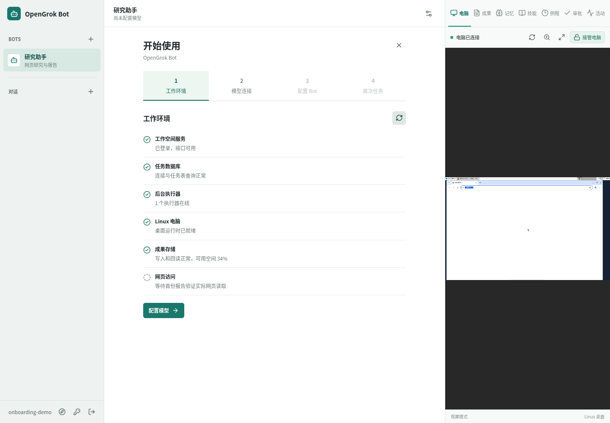
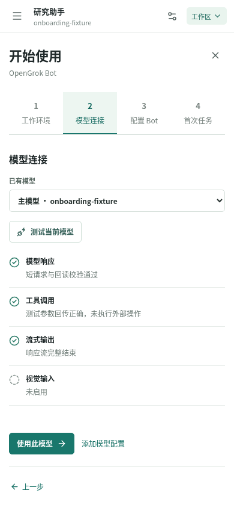

<h1 align="center">OpenGrok Bot</h1>

<p align="center">拥有持久 Linux 电脑的个人 Agent。模型可替换，桌面可接管。</p>

<p align="center">
  <strong>简体中文</strong> · <a href="README.en.md">English</a>
</p>

<p align="center">
  <a href="#本地启动">本地启动</a> ·
  <a href="#界面预览">界面预览</a> ·
  <a href="ARCHITECTURE.md">架构</a> ·
  <a href="docs/TESTING.md">测试</a>
</p>


<p align="center"><sub>隔离演示环境中的真实界面，使用固定响应测试模型。截图不代表真实模型的回答质量。</sub></p>

为 Bot 设置名字、职责和模型，在聊天中交付任务。Bot 在可见的 Linux 桌面中读取网页、处理文件、生成可打开的成果，并保留自己的跨对话记忆。关闭浏览器后，后台 Worker 继续推进任务。

产品形态参考 Grok Bot，支持 OpenAI 兼容接口与 Anthropic 协议，不绑定 xAI。

> 当前为个人自托管开发原型。仅用于受信任的 Linux 单机环境，请勿直接向公网或不受信用户开放。

## 可以做什么

| 你的任务 | Bot 的工作方式 |
| --- | --- |
| 研究网页，交付报告 | 实际打开并读取来源，发布可预览、下载的 Markdown 文件 |
| 让任务在后台继续 | 保存任务状态、工具回执和进度，客户端断连不结束任务 |
| 接手电脑上的操作 | 查看同一台 Linux 桌面，接管浏览器，完成后归还控制 |
| 记住长期工作偏好 | 按 Bot 保存记忆，支持查看、编辑、删除和跨对话读取 |
| 重复执行已有工作 | 将指令保存为版本化技能，配置按时区触发的每日例程 |
| 把任务交给另一个 Bot | 显式传递任务和成果，追踪独立运行的子任务 |

每个用户共享一台 Docker Linux 电脑，Bot 的记忆分别保存。模型负责推理，应用负责任务恢复、审批、预算和成果校验。实现使用 React、Fastify、PostgreSQL、Playwright 与 noVNC，详见[架构设计](ARCHITECTURE.md)。

## 本地启动

需要 Linux、Node.js 22、pnpm 11、Docker Compose 和可用的 systemd 用户会话。网络脚本依赖 Linux 防火墙，并使用免交互 `sudo`；安装前请确认权限。macOS 和 Windows 部署尚未验证。

### 1. 准备项目

```sh
git clone https://github.com/maxliux5/opengrok-bot.git
cd opengrok-bot
pnpm install
pnpm dev:init
sudo -n env DOCKER_CONFIG="$HOME/.docker" docker compose -f infra/desktop/compose.yaml build desktop
pnpm --filter @opengrok/web build
pnpm tls:init
```

`dev:init` 在 Git 忽略的 `.local/` 中生成随机凭证。镜像下载需要联网；如果宿主机需要上游代理，请在下一步安装前配置 `OPENGROK_BROWSER_PROXY`，见[网络与运行配置](OPERATIONS.md)。

### 2. 启动本机服务

```sh
node scripts/install-user-services.mjs --dry-run
node scripts/install-user-services.mjs
systemctl --user enable --now opengrok-network.service opengrok-egress.service \
  opengrok-containers.service opengrok-host.service opengrok-api.service \
  opengrok-worker.service opengrok-worker-2.service \
  opengrok-web.service opengrok-monitor.timer
OPENGROK_MIN_WORKERS=2 pnpm monitor
```

等待监测返回 `"status":"ok"`，然后打开 **[https://127.0.0.1:8443/](https://127.0.0.1:8443/)**。默认使用本机自签证书，需要在浏览器信任。升级已有安装、退出登录后保持服务、停止与备份的步骤见[运行手册](OPERATIONS.md)。

### 3. 创建账号并完成首个任务

1. 从本机 `.local/setup.token` 读取初始化口令，在页面创建自己的用户名和密码。口令不要发到聊天或提交到仓库，建号成功后文件自动删除。
2. 按向导完成**工作环境 → 模型连接 → 配置 Bot → 首次任务**。填入模型地址和密钥，测试通过后保存。
3. 提交首份报告，打开成果查看正文和来源。在**电脑**视图点击**接管电脑**可操作桌面，结束后**归还控制**。

已有账号可从侧栏指南针重新打开向导。连接测试可能产生少量模型费用；图片识别仍需单独验证。手动启动 HTTP 开发环境见[开发与测试](docs/TESTING.md)。

## 界面预览

<details>
<summary>首次建号与使用向导</summary>




<p align="center">
  
  
</p>

</details>

<details>
<summary>可接管的 Linux 桌面与手机成果页</summary>


<p align="center">
  
  
</p>

</details>

<details>
<summary>Bot 记忆、每日例程与任务交接</summary>


</details>

<details>
<summary>GitHub Issue 的逐次审批</summary>


<p align="center"></p>

</details>

除首次建号画面外，截图均来自隔离演示或测试库。报告、向导、记忆和例程使用固定响应模型；手机桌面使用公开 Sauce Demo；交接材料由测试给定。GitHub 审批连接本机假 API，没有写入外部仓库。

## 验证与限制

截至 2026-10-09，真实 TraeX Gemini 已通过首次使用向导、网页读取、报告发布和桌面接管后的回读。固定模型回归覆盖两种协议、流式响应、错误密钥、超时、环境故障与手机布局。可复现步骤和证据见[测试说明](docs/TESTING.md)与[实施记录](PLAN.md)。

冻结题集的内容复核结果为 Gemini `31/36`、Claude Sonnet `26/36`、Astra `36/36`，门槛为 `30/36`。每个模型运行相同的 12 题、各 3 次，均经同一 TraeX Proxy。这些数字只适用于该题集，完整口径见[模型评测](eval/README.md)。

- 同一用户的 Bot 共用电脑文件和网站登录，Bot 之间没有凭证隔离。
- 新 Bot 默认关闭终端和完整桌面能力，启用后的相应动作仍需逐次审批。完整桌面截图可能包含私人信息，并会发给所选模型。
- 出口网关与防火墙限制直连、内网和宿主机访问。DNS 外传及 Docker 或防火墙重载的瞬时边界仍有风险，不能作为不受信程序的强隔离。
- 自主桌面坐标定位、真实 GitHub 写入、异机备份、公网部署与长期稳定性仍待验收。取消任务无法撤销已经发生的外部效果。

## 文档

| 你想了解 | 阅读入口 |
| --- | --- |
| 启停、HTTPS、网络、备份与恢复 | [运行手册](OPERATIONS.md) |
| 开发环境、端到端测试与故障注入 | [开发与测试](docs/TESTING.md) |
| Agent、电脑、记忆与状态所有权 | [架构设计](ARCHITECTURE.md) |
| 架构取舍及重新评估条件 | [设计决策](DESIGN_DECISIONS.md) |
| 已完成项目、验收记录与后续计划 | [实施计划](PLAN.md) |
| 真实模型的任务质量与失败样本 | [评测方法和结果](eval/README.md) |
