# OpenGrok Bot

[简体中文](README.md) | [English](README.en.md)

构建 Grok Bot 式的个人 Agent 产品：用户创建有名字和职责的 Bot，通过聊天交付任务；Bot 在持久 Linux 电脑上工作，跨对话保留记忆，需要人处理时交回控制，完成后提供可检查的成果。

模型供应商可替换。电脑采用 Docker + Linux 桌面。首个版本面向个人自托管使用。

## 界面截图

首次建号截图来自正式零账号入口，未输入初始化口令。其余画面来自与正式工作空间隔离的演示或测试库。报告、电脑、记忆和例程示例使用固定响应测试模型与 `example.com`；手机桌面图使用公开 Sauce Demo 演示站点；交接图使用独立测试库中的人工给定材料；GitHub 审批图使用本机假 GitHub API，没有写入外部仓库。截图展示已实现的 Web 流程，不代表真实模型的任务质量。

### 首次建号

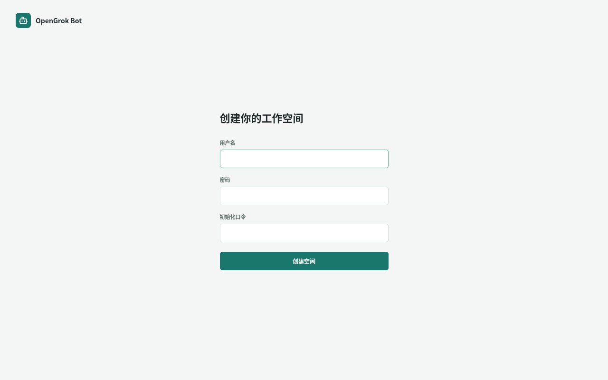

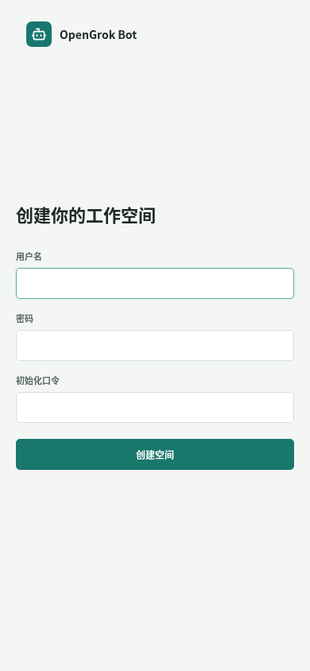

### 网页研究与成果

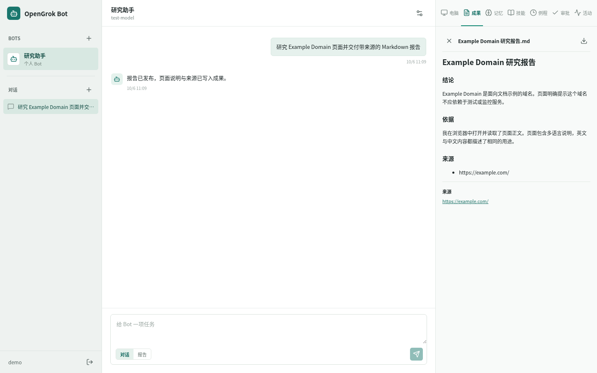

### 持久 Linux 电脑

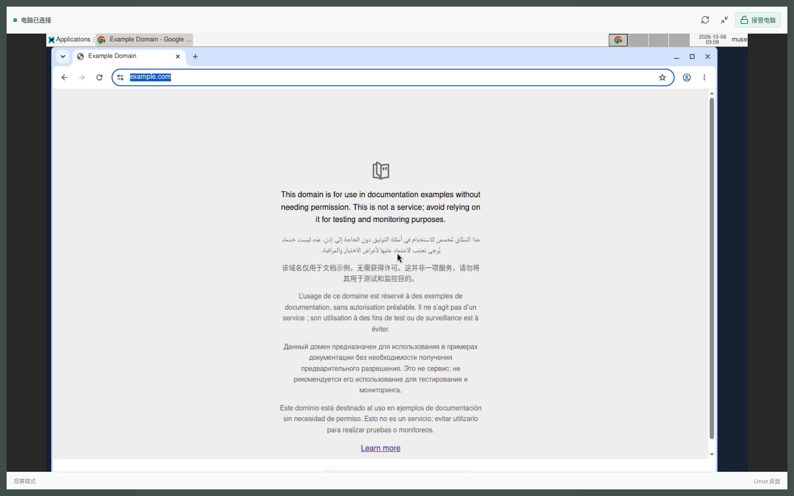

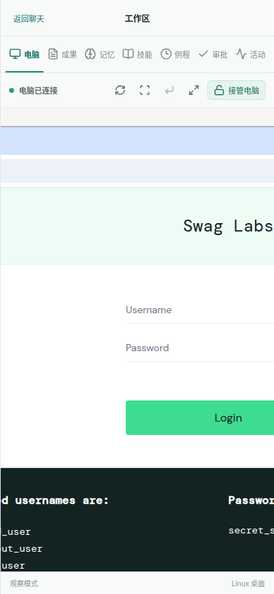

### Bot 记忆与每日例程

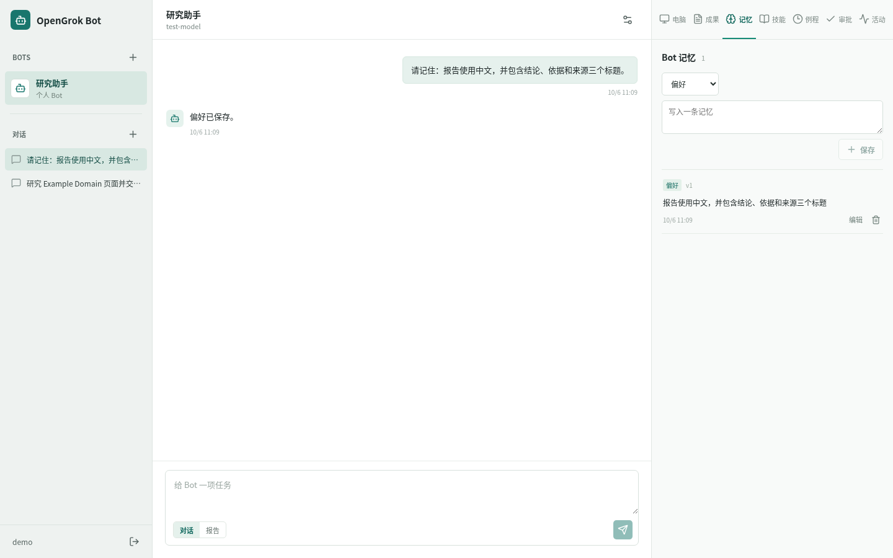

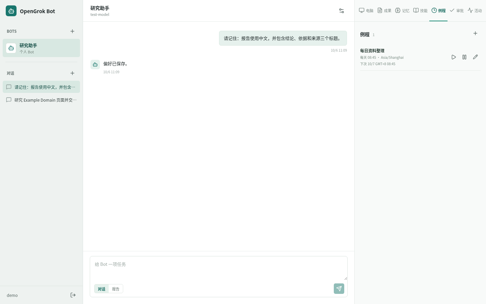

### 多 Bot 交接

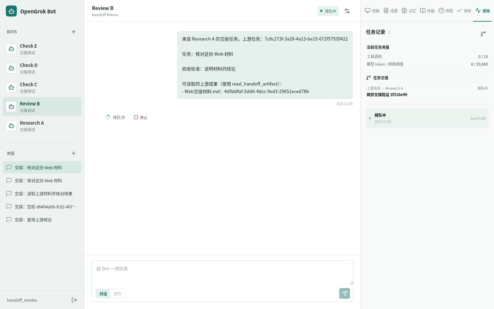

### GitHub Issue 审批

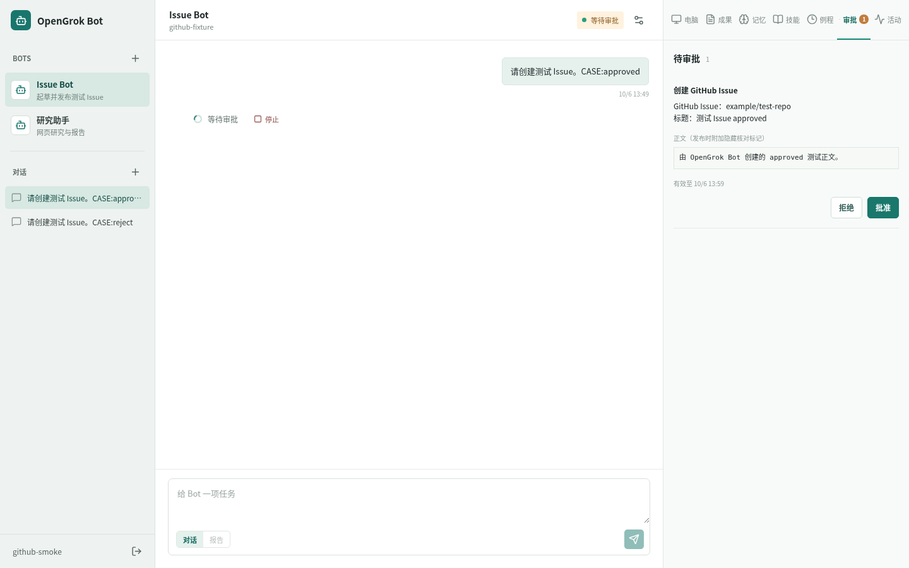

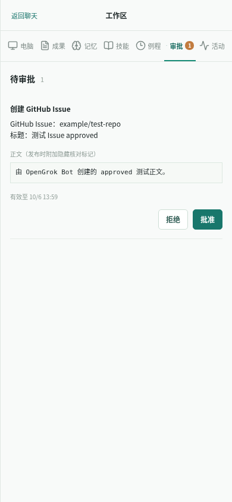

### 手机成果页

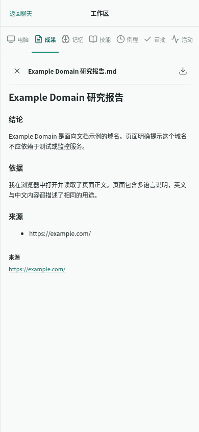

## 当前状态

正式本机 Web 的首个账号需要初始化口令。安装用户服务时，脚本在被 Git 忽略的 `.local/setup.token` 生成权限 0600 的随机口令；首次打开 [HTTPS 页面](https://127.0.0.1:8443/) 时从本机读取口令，在页面设置自己的用户名和密码。成功后口令文件删除。开发模式可在未配置 `OPENGROK_SETUP_TOKEN_FILE` 时使用独立测试库，正式部署始终启用该校验。口令只防止不知道文件内容的本机进程抢先建号，同 UID 进程仍属于受信任边界。正式工作空间仍无账号。

2026-10-06：已有可运行的个人版开发原型。Web、API、常驻 Worker、PostgreSQL、computer-host 和 Docker Linux 桌面已接通。固定响应测试覆盖网页研究到 Markdown 成果、断连后续跑、Bot 私有记忆、审批命令、桌面接管，以及 OpenAI 兼容和 Anthropic 两种协议。模型默认流式处理，文本增量单独保存；配置可选择非流式响应。工具的 schema、授权、执行位置及回执策略已收敛到注册表。公共网页浏览、工作目录文本读写、截图成果和 Run 专属 staging 报告已打通。完整桌面截图、逐次审批的键鼠操作和终端逐命令状态/停止也已接通。隔离测试库通过 TraeX proxy 的真实 `Gemini-3-Flash-Preview` 完成报告、跨对话格式偏好、经审批的表单操作、工作文件回读与截图；人工给定坐标的桌面输入 Run 也成功，最终值经独立回读。视觉配置在下一步可收到经摘要复核的截图，图片字节不写入模型步骤快照；随机数字图像和真实浏览器截图的 Gemini 识别均通过。Gemini 自行估算桌面控件坐标的两次 Run 失败，不能宣称自主视觉定位可靠。

真实 Claude Sonnet 经 TraeX Proxy 的 Anthropic 协议也完成了同一网页报告契约。将已有 Bot 从 Gemini 切换至 Claude 后，新 Run 读回旧历史、偏好、工作文件和浏览器页面。冻结的 12 题各重复 3 次：Gemini 与 Claude 的机械检查均为 36/36，逐份核对研究内容后的合格数分别为 31/36、26/36；Claude 低于 30/36 发布门槛。随后在隔离库运行相同任务集，`traex/GPT-6-Astra` 的机械检查与人工复核均为 36/36。Gemini 和 Astra 这两个模型 ID 达到当前题集的质量门槛；它们与 Claude 均经同一 TraeX Proxy，未证明上游身份、独立网关可用性或费用。完整口径、失败样本和复现方法见 [eval/README.md](eval/README.md)。

当前本机入口：[https://127.0.0.1:8443/](https://127.0.0.1:8443/)（自签证书需在本机信任）。HTTP 开发入口已停用，按需单独启动。正式工作空间尚未创建账号，首次打开由你设置密码；随后在 Bot 设置中添加自己的模型配置。服务只监听本机，远程访问仍需可信证书、域名与独立的网络边界。独立的 `8444` HTTPS 测试实例已通过登录安全 Cookie、`wss` 桌面画面、Web 接管演示站点登录、归还后的 Agent 页面回读，以及未登录桌面连接拒绝；正式账号体验仍需实际验收。390px 和 320px 手机可在适应窗口与原尺寸裁剪之间切换、拖动画面且无横向溢出；390px 下接管后触摸地址栏、输入公开站点并经屏幕回车按钮完成导航。复杂桌面应用的手机触控体验仍需更多场景验证。

登录后可用侧栏底部的钥匙按钮修改密码，更新时其他登录会话失效。`tests/password-web-smoke.mjs` 已在独立测试库验证旧密码拒绝、新密码登录、旧事件流关闭和 390px 手机弹窗；加上 `OPENGROK_PASSWORD_HTTPS_TEST=1` 后，同一流程在自签 HTTPS `8444` 验证了登录与改密 Cookie 的 `Secure`、`HttpOnly`、`SameSite=Lax` 属性。正式工作空间仍无账号，首次密码由你在页面设置。

每个任务创建时固定预算，默认 12 个模型步骤、30 次工具调用、40,000 token 续跑阈值、24 小时墙钟时间，单次模型调用限 120 秒、输出限 2048 token，单个成果限 2 MB。活动面板显示工具及 token 消耗。墙钟时间包含排队与人工等待；供应商没有返回用量时显示“含估算”，该值只用于预算保护。token 用量在一次调用后才知道，最后一次调用可能使累计值超过阈值；已观察到 50,308 token 的 Run。默认值可通过 `OPENGROK_MAX_MODEL_STEPS`、`OPENGROK_MAX_TOOL_CALLS`、`OPENGROK_MAX_TOKENS`、`OPENGROK_MAX_RUN_WALL_MS`、`OPENGROK_MAX_MODEL_CALL_MS`、`OPENGROK_MAX_MODEL_OUTPUT_TOKENS`、`OPENGROK_MAX_ARTIFACT_BYTES` 配置，新值只影响新任务。

Bot 设置可控制网页浏览、工作文件、成果、记忆、终端和完整桌面能力。新 Bot 默认关闭终端与完整桌面；开启终端后，每条命令仍需审批，活动视图可查看回执并单独请求停止在途命令。桌面键鼠同样逐次审批，并展示待操作截图和坐标或输入内容；完整截图可能包含私人信息。Run 保存创建时的能力上限，新增授权只用于新任务，撤销立即阻止现有任务继续使用该能力。报告任务需要同时启用网页浏览与成果发布。模型、Worker 和 computer-host 分别过滤或复核能力，成功回执还要通过工具结果校验。记忆能力关闭时不再注入旧偏好；开启时只注入有上限的核心记忆，其他记录通过词法搜索读取。

新增模型配置时需声明文本、工具、视觉、流式能力；文本为必需，其余按供应商实际支持选择。旧配置默认不启用视觉。关闭工具时模型不会收到工具定义，报告任务会明确报错；关闭流式时使用整段响应。能力由配置声明，应用不会自动探测供应商是否真正支持图片。

技能库支持从成功 Run 起草、人工编辑、不可变版本、多个 Bot 绑定及 Run 版本快照。每日例程支持 IANA 时区、固定输入、单次预算、可选固定技能版本、暂停、试跑与运行历史；定时触发经持久 occurrence 去重，并进入普通 Run。隔离库验证了十天漏触发合并最近一次、并发投递只生成一个 Run、权限撤销显式失败、审批过期后不自动批准。已持久化的例程触发记录在 Worker 重启后只投递一次，原 Run 恢复并发布报告；独立墙钟测试也在预定分钟自然触发，重启后仍只有一个 occurrence 和 Run。模拟网站失效时，例程历史会显示包含网页错误的失败原因，电脑操作只派发一次，次日计划保留。次日第二次自然触发、真实站点故障和长期稳定性仍需验收。

多 Bot 交接已有基础闭环：可在活动视图手动指定目标 Bot、任务、验收标准和最多 3 份 Markdown 成果；开启 `delegate` 能力后，Bot 也可调用交接工具。子任务在目标 Bot 的独立对话中异步运行，父子状态可互相跳转，子 Bot 通过授权引用读取上游成果，私有记忆仍各归其主。深度、后代数量、整树预算和回到祖先 Bot 均受限制。隔离库已验证手动与 Agent 交接、重复请求、Web 桌面/手机流程，以及子 Run 提交后 Worker 崩溃的回执恢复。真实 TraeX Gemini 的聚焦样例中，3 次明确交接均首次调用成功，2 次明确要求自行处理均未交接；子 Bot 使用固定响应模型，只验证代号传递和执行闭环，未评估审阅质量。子任务完成后暂不自动汇总到父 Bot，通用交接决策质量仍待更大样本验收。

GitHub Issues 是首个业务连接器候选。Bot 显式开启 `github_issues` 能力后，可起草标题和正文；Web 展示固定目标仓库及全文，用户逐次批准后 Worker 才向 GitHub 创建 Issue，并回读标题、正文和地址。操作 ID 先持久登记；响应丢失时按隐藏标记核对，不自动重复提交。本机假 GitHub API 的隔离测试通过拒绝审批零写入、Web 桌面/手机审批、批准后回读、批准后撤销能力零写入、明确 403 零创建，以及丢响应只创建一条 Issue。真实仓库写入与业务结果尚未验收，连接器默认未配置，配置方式见 [OPERATIONS.md](OPERATIONS.md)。

本机现运行两只 Worker：不同 Bot 的推理可以并行，同一 Bot 仍只运行一个任务；电脑动作进入 host 的串行队列。隔离测试观察到模型最大并发 2、电脑动作最大并发 1，两次操作均成功。host 在一条动作执行、另一条排队时重启，前者留下未知效果待核对，后者明确记录为未派发失败，没有被送到桌面。正式零账号实例的双 Worker 监测返回 `ok`；真实 GUI 高负载和交接任务质量仍需评测。

仍未验收：Claude Sonnet 的研究报告质量达到发布门槛、模型自主桌面坐标精度、异机备份保留、公开部署，以及首个真实业务连接器。本机离线备份已在新数据库、目录和桌面卷完成隔离恢复：旧报告可经 API 打开，新 Run 成功，恢复桌面可读工作文件及网页，恢复 Host 的回执与开发实例隔离；步骤见 [OPERATIONS.md](OPERATIONS.md)。本机自签 HTTPS Web、systemd 用户服务和每分钟监测已运行；监测只留下退出码及 journal 记录，没有外部通知接收方。多次 Docker 桌面重建还验证了工作文件摘要不变、带 `Max-Age` 的测试 cookie 保留；公开演示登录站点也完成 Web 接管登录及容器重建后的已登录页面回读。该站点的结果不能代表所有网站：无过期时间的会话 cookie 曾在另一个测试站未恢复，个人网站的 MFA 和会话寿命仍需单独验证。桌面异常时可从 Web 明确确认重启，重启期间接管与 Agent 操作被阻断，新会话健康后才恢复。直接向 RFB 连接发送键盘、指针和剪贴板消息的测试连续通过：观察模式均未改动桌面状态，人类模式下同样消息生效。已对“电脑动作成功但 HTTP 响应丢失”完成一次故障注入，回执核对后只执行 1 次；另有一次真实网页导航超时，在确认执行器空闲后由用户确认，携带未知效果记录结束 Run 并释放 Bot 执行槽。后者只验证了这一种超时场景。[PLAN.md](PLAN.md) 中未勾选的项目继续有效。

独立的服务重启回归已验证：API 停机时 Worker 继续推进，旧 Worker 退出后未知电脑操作依回执恢复且未重复导航，桌面重建后新 Run 发布报告。脚本会重建桌面，只允许在正式库零账号且电脑空闲时执行；已登录正式用户的整套重启体验仍未验收。

## 本地启动

需要 Node.js 22、pnpm 11、可访问的 Docker daemon 与 Compose。以下是新检出目录的开发启动方式，均从项目根目录执行。当前网络准备脚本使用本机已有的免交互 sudo 权限。先完成一次性准备：

```sh
pnpm install
pnpm dev:init
sudo -n env DOCKER_CONFIG="$HOME/.docker" docker compose -f infra/desktop/compose.yaml build desktop
node scripts/prepare-desktop-network.mjs
```

在独立终端运行 `node scripts/start-egress.mjs`，保持网关运行；再运行 `node scripts/start-containers.mjs` 启动数据库和桌面。

`.local/dev.env` 由脚本一次性生成，包含随机数据库口令，已被 Git 忽略。在运行 API、Worker 和 computer-host 的每个终端先执行 `set -a; source .local/dev.env; set +a`，再分别运行 `pnpm dev:host`、`pnpm dev:api`、`pnpm dev:worker`。最后运行：

```sh
pnpm dev:web
```

真实模型测试和评测须显式设置 `OPENGROK_TEST_PROXY_CONFIG="$PWD/.local/test-proxy.json"`，文件权限设为 `0600`，内容为 `{"baseUrl":"https://你的代理地址/v1","apiKey":"你的测试密钥"}`；也兼容已有配置中的 `providers.cliproxy` 结构。该文件位于被 Git 忽略的 `.local/`，不要提交真实密钥。使用共用隔离测试库的 `smoke` 账号时，另设 `OPENGROK_TEST_PASSWORD` 为该账号的密码；Web 接管测试使用 `OPENGROK_WEB_SMOKE_PASSWORD`。测试若使用系统 Chromium，可设置 `OPENGROK_TEST_CHROMIUM_EXECUTABLE=/path/to/chromium`；未设置时使用 Playwright 自带浏览器。

若宿主机访问公开 HTTPS 需要上游代理，在启动 `start-egress.mjs` 前设置 `OPENGROK_BROWSER_PROXY=http://代理地址:端口`；该值只留在宿主机网关，桌面容器收到的是本机网关地址。桌面网桥的转发流量仅放行指定 DNS，其他直连出网拒绝；到宿主机只开放网关端口。网关仅允许公开地址上的 HTTP `80` 与 HTTPS `443`，逐次检查 DNS 并固定连接 IP；受审批的终端命令通过代理环境变量走同一路径。仍可能通过 DNS 请求泄露信息，容器内不受管程序也可能产生外部副作用；当前只适合受信任的个人本机环境。具体规则与验收见 [OPERATIONS.md](OPERATIONS.md)。

若当前账号无 Docker daemon 权限，Compose 命令使用管理员提供的访问方式；本机可用 `sudo -n env DOCKER_CONFIG="$HOME/.docker" docker compose ...`。不要开放 Docker socket 给桌面容器。首次镜像下载依赖网络；本机使用官方 Playwright 镜像 `v1.63.0-noble`，Docker daemon 直连拉取受限时，通过用户态 `crane` 下载后载入，未改动 daemon 代理或现有容器。

常规检查：`pnpm test`、`pnpm -r typecheck`、`pnpm --filter @opengrok/web build`。`tests/` 中的大部分 E2E 脚本使用隔离测试库与固定响应模型；`tests/budget-smoke.mts` 覆盖 7 种预算边界，`tests/capability-smoke.mts` 与 `tests/capability-approval-smoke.mts` 覆盖授权快照、撤销和 host 拒绝。`tests/control-pending-smoke.mjs`、`tests/control-host-busy-smoke.mts` 与 `tests/control-web-pending-smoke.mjs` 分别验证运行时、host 在途操作和 Web 交接；`tests/web-login-takeover-smoke.mjs` 验证公开演示站点的 Web 接管登录与 Agent 回读，也可通过 `OPENGROK_WEB_SMOKE_ORIGIN=https://127.0.0.1:8444/` 在已启动的隔离 HTTPS 服务上验证安全 Cookie、`wss` 桌面画面和未认证连接拒绝，需同时设置脚本要求的独立测试目录及端口。`OPENGROK_ALLOW_DESKTOP_RESTART_TEST=1 node tests/login-persistence-smoke.mjs` 验证该登录状态在容器重建后保留。`tests/cancel-inflight-smoke.mts` 验证终端执行中定向停止及丢响应后核对，`tests/shell-stop-smoke.mjs` 验证停止意图先到时命令不会启动，`tests/web-cancel-approval-smoke.mjs` 验证桌面和移动 Web 的审批等待取消。`OPENGROK_ALLOW_DESKTOP_RESTART_TEST=1 node tests/restart-smoke.mjs` 会实际重建桌面容器，应只在无重要桌面任务时运行。`tests/real-traex-interactive.mts` 使用真实 Gemini 验证表单交互。单次真实模型测试仍不能代替完整质量评测。

`OPENGROK_ALLOW_EGRESS_FAILURE_TEST=1 node tests/egress-failure-smoke.mjs` 会短暂停掉正式网关，验证桌面直连仍被拒、监测报警且恢复后正常；脚本要求正式零账号、电脑空闲，不能在个人工作会话中运行。

`OPENGROK_ALLOW_ISOLATED_EGRESS_TEST=1 node tests/isolated-desktop-egress-smoke.mjs` 在一次性第二网桥和空白桌面上复验出网规则并自动清理。传入恢复清单、相对文件路径与预期 SHA-256 时，它会克隆恢复卷并核对旧工作文件；再设置 `OPENGROK_ISOLATED_AGENT_TEST=1` 可运行固定响应 Host/API/Worker 报告任务，增加 `OPENGROK_ISOLATED_RESTORED_DB_TEST=1` 则会克隆恢复数据库和成果，经正常登录验证旧成果及新报告。2026-10-06 的本机联合测试通过；异机恢复和真实模型质量仍需另验。

真实模型出网回归可运行 `OPENGROK_ALLOW_REAL_EGRESS_TEST=1 OPENGROK_REAL_EGRESS_DB=opengrok_real_egress_<新后缀> node tests/real-traex-egress-runner.mjs`。它要求正式零账号、电脑空闲与未使用过的测试库名，自建隔离库和 API/Worker/Host，复用当前桌面完成 Gemini 报告、记忆和新对话格式回读；结束时停止隔离服务并清空测试模型密钥。2026-10-06 的一次完整运行通过，详见 [PLAN.md](PLAN.md)。

`tests/service-restart-smoke.mts` 会杀停隔离 API/Worker、注入一次丢回执故障、重建桌面，并验证例程触发记录在 Worker 重启后去重与续跑；它要求全新 `opengrok_restart_*` 数据库、专用 `.local/restart-*` 数据目录和 `OPENGROK_ALLOW_DESKTOP_RESTART_TEST=1`。脚本会校验正式库零账号及电脑空闲，详细证据见 [PLAN.md](PLAN.md)。

多 Bot 交接测试依次运行 `tests/handoff-smoke.mts`、`tests/handoff-agent-smoke.mts` 和 `tests/handoff-web-smoke.mts`。它们要求新建的 `opengrok_handoff_20261006` 隔离数据库、API `3841`；Agent 用例会临时启动固定响应模型 `3850` 和隔离 Worker，Web 用例使用指向该 API 的预览入口 `8444`。`tests/handoff-recovery-smoke.mts` 另需全新 `opengrok_handoff_recovery_20261006` 库与专属 `.local/handoff-recovery-20261006` 数据目录，脚本自启假模型和 Worker，在交接写入后杀停 Worker，核对回执恢复和唯一子 Run。不要指向个人正式库。

`tests/real-handoff-traex.mts` 使用真实 TraeX Gemini 发起交接、固定响应子 Bot 回传代号，需全新 `opengrok_real_handoff_YYYYMMDD` 隔离库及对应的专属 `.local/` 数据目录。脚本自启隔离 Worker，检查 3 次正例首次交接与 2 次反例不交接，结束时清空测试配置密钥；不需要 API、Host 或桌面。该聚焦测试不替代冻结任务集与真实业务结果评估。

`tests/github-issue-smoke.mts` 需要全新 `opengrok_github_YYYYMMDD` 隔离库及专属 `.local/` 目录，自启假模型、假 GitHub API、API、Worker 与 Web 预览；检查拒绝审批、桌面/手机全文预览、批准后回读、批准后撤销能力、明确 403 和丢响应恢复，截图保存在 `docs/screenshots/`。测试令牌只发往本机假 API。真实 GitHub 写入需要另选明确授权的测试仓库，不在此脚本中执行。

`tests/parallel-bots-smoke.mts` 要求全新 `opengrok_parallel_YYYYMMDD` 隔离库，通过 `OPENGROK_DB_NAME` 和 `OPENGROK_PARALLEL_DB_NAME` 同时指定；脚本自启两只 Worker、假模型、假 desktop-runtime 和隔离 host，验证推理并行、电脑串行及 host 重启时的排队回执。它不会访问正式桌面。

真实模型回归需要隔离测试数据库、API `3841`、Worker 和 Host `3844`。默认数据目录与开发 Host 共用电脑操作 journal，不能同时运行；若同时运行，应为测试 Host/Worker/API 显式配置独立 `OPENGROK_DATA_DIR`、桌面 runtime/VNC 端口和测试数据库，且测试 Host 设置 `OPENGROK_DESKTOP_MANAGED=0`。`pnpm exec tsx tests/real-traex-smoke.mts` 默认测 TraeX Gemini 报告及跨对话偏好；`OPENGROK_TEST_PROVIDER=anthropic OPENGROK_TEST_MODEL_ID=agy/claude-sonnet-4-6 pnpm exec tsx tests/real-traex-smoke.mts` 测同一契约的 Claude；`pnpm exec tsx tests/real-provider-switch.mts` 测同一个 Bot 从 Gemini 切到 Claude 后的状态复用。脚本读取 `OPENGROK_TEST_PROXY_CONFIG` 指向的私有文件，结束时清空测试模型配置中的加密密钥；它预期 `3841` 上有 `smoke` 测试账号，不应指向个人正式数据库。

视觉链路可用 `pnpm exec tsx tests/traex-vision-smoke.mts` 单独测试 TraeX Gemini 图像输入。`tests/real-traex-vision-run.mts` 需要隔离 API、Worker、Host 和测试数据库；它会在公开表单中填入随机数字，再要求模型仅通过截图识别，并在结束时清空测试模型密钥。`tests/desktop-runtime-smoke.mjs` 验证完整桌面的截图、键鼠与 Unicode 输入；`tests/desktop-approval-invalid-smoke.mts` 验证越界和旧观察拒绝。`tests/real-traex-desktop-run.mts` 使用人工校准坐标验证真实模型、截图、审批、点击和输入链路；不把它计为自主视觉定位成功。`tests/shell-command-stop-smoke.mts` 可设置 `OPENGROK_STOP_VIA_WEB=1` 从 Web 按钮停止单条在途命令，`tests/web-shell-command-smoke.mjs` 检查终端回执的桌面和手机呈现。完整执行记录见 [PLAN.md](PLAN.md)。

## 阅读入口

- [PLAN.md](PLAN.md)：产品范围、里程碑、工作拆分、验收用例、交付标准和当前环境准备项。
- [ARCHITECTURE.md](ARCHITECTURE.md)：领域对象、模块所有权、Docker 桌面、模型适配、Run 恢复、记忆、审批与接口草图。
- [DESIGN_DECISIONS.md](DESIGN_DECISIONS.md)：两种架构的比较、最终选型、接受的代价及重新评估条件。
- [eval/README.md](eval/README.md)：冻结任务集、人工复核口径、双模型基线与复现步骤。
- [OPERATIONS.md](OPERATIONS.md)：本机启停、离线备份、隔离恢复、升级与故障排查。

## 第一条验收路径

1. 创建研究 Bot，选择一个已配置且满足能力要求的模型。
2. 让它研究一个问题，在同一台可见电脑中浏览网页，生成带来源的报告。
3. 任务执行期间关闭客户端，稍后重新打开查看进度和结果。
4. 告诉 Bot 一个报告格式偏好，查看它确实保存的记忆。
5. 新建对话，不重复该偏好，验证下一份报告采用该格式。
6. 重建桌面容器后，工作文件与测试网站的登录状态仍可使用。

## 已确定的边界

- 每个用户一台持久电脑；Bot 的记忆独立，电脑里的文件和网站登录由该用户的 Bot 共享。
- API、后台 Worker 和数据库保存产品状态；桌面重建不会删除 Bot、聊天、Run 和记忆。
- Agent 与用户操作同一个有界面的浏览器。接管期间 Agent 停止新的电脑操作。
- 模型适配器提供推理；任务恢复、记忆、工具权限和成果校验由应用负责。
- 首个版本使用单仓库、PostgreSQL 和 Docker Compose；按模块拆分，暂不引入 Redis、Kubernetes 或额外工作流平台。
- Chromium 以非 root 身份运行，并使用固定的 Playwright seccomp 配置启用 `chromiumSandbox`；这项隔离已在本机容器验证。浏览器按 URL 和当次 DNS 结果拒绝本机/内网 HTTP(S) 与 WebSocket 目标，并禁用 Service Worker 以避免绕过请求拦截；依赖 Service Worker 的离线网站功能可能受影响。正式桌面已加宿主机出口网关和网桥防火墙：直连公网、内网和宿主机被拒，公开网页经网关可达；容器重启策略为 `no`，启动服务先验证防火墙与网关。当前规则依赖本机 Docker/iptables 拓扑，Docker daemon 或宿主机防火墙重载后的瞬时边界尚未完成故障注入，不能当作不受信程序的强隔离。取消 Run 或逐命令停止会向在途受管 shell 进程组发送停止信号，已产生的外部效果和脱离进程组的程序无法靠该信号撤销。`desktop` 能力会将完整桌面截图发给所选模型供应商，默认关闭。只在受信任的个人本机环境使用，不向公网或不受信用户开放。

## 当前环境记录

本机为 Linux x86_64，Docker daemon/client `20.10.24+dfsg1`，用户目录 Compose `v5.6.0`，PostgreSQL 开发镜像 `16.9-bookworm`，Node `22.23.2`，pnpm `11.5.1`。当前账号通过现有的免交互 sudo 访问 Docker；桌面容器没有挂载 Docker socket。旧的本地 PostgreSQL 15 测试实例与新的 Compose 开发数据库分开，均使用回环地址，不向局域网开放。正式库已迁移到第 17 版：第 13 版改为相对成果路径，第 14 版新增 Worker 心跳，第 15 版新增技能库，第 16 版新增例程及唯一触发记录，第 17 版新增父子任务及成果引用；正式库仍为零账号、零例程。历史 121 条测试成果迁移后均可按原摘要读取，本机整套离线备份与隔离恢复也已演练。
